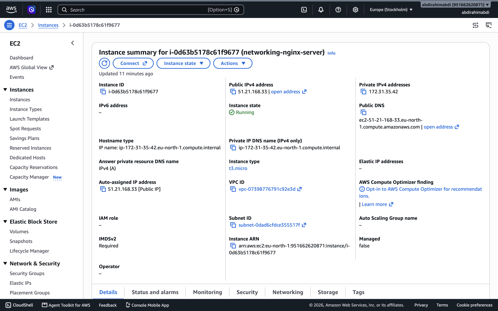
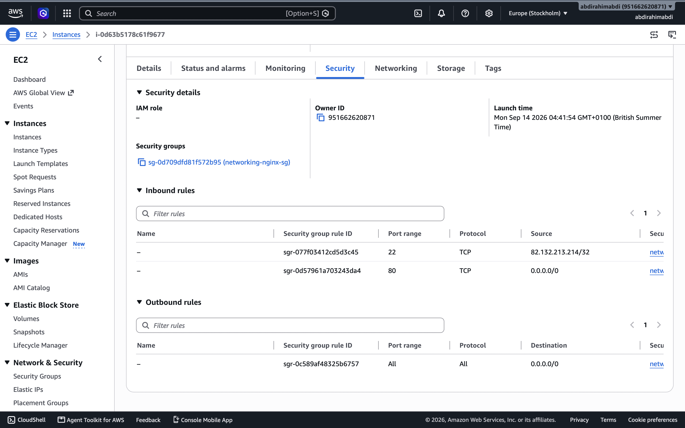
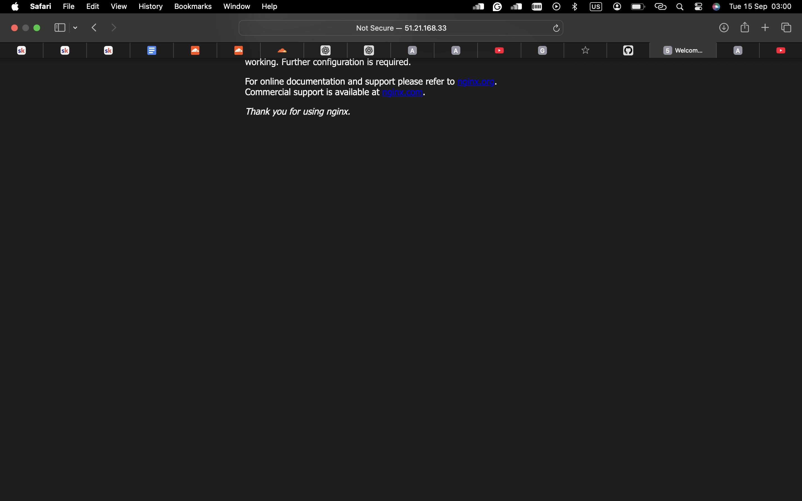
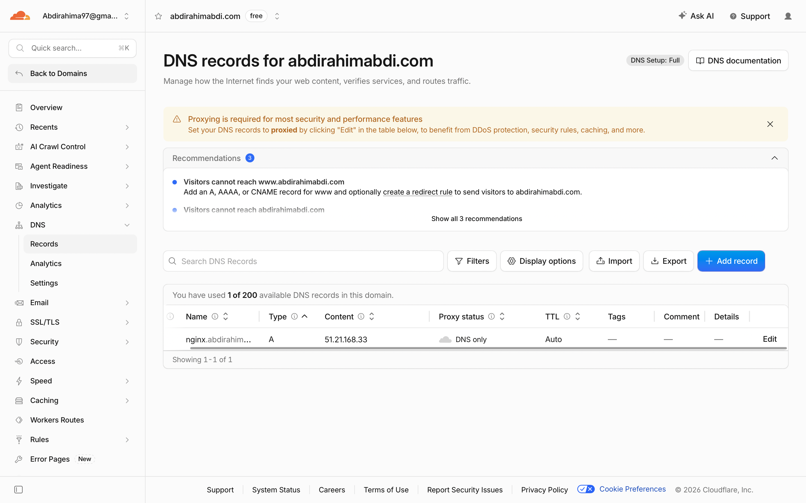

# devops-learning

 Networking Project — EC2, NGINX & DNS

## 1. Project Overview

For this project, I set up a web server using an AWS EC2 instance and NGINX.

I also configured a custom domain using Cloudflare DNS and created an A record pointing my domain/subdomain to the public IPv4 address of my EC2 instance.

The purpose of this project was to understand how DNS, IP addresses, ports, security groups, EC2 and web servers work together.

---

## 2. What I Built

The final setup looks like this:

```text
                    Internet
                       |
                       v
              nginx.abdirahimabdi.com
                       |
                       | DNS A Record
                       v
                EC2 Public IP
                       |
                       | HTTP :80
                       v
                    NGINX
                       |
                       v
               NGINX Web Page
```

The main components I used were:

* AWS EC2
* Ubuntu Linux
* NGINX
* Cloudflare DNS
* DNS A record
* AWS Security Groups
* SSH
* HTTP

---

## 3. AWS EC2 Setup

I created an EC2 instance using Ubuntu.

### Instance details

* Instance name: `networking-project`
* Operating system: Ubuntu
* Purpose: Host the NGINX web server
* Web server: NGINX

The EC2 instance was given a public IPv4 address so that it could be reached from the internet.

### Screenshot



---

## 4. Security Group Configuration

I configured the EC2 Security Group to allow the traffic required for the project.

| Protocol | Port | Source    | Purpose          |
| -------- | ---: | --------- | ---------------- |
| TCP      |   22 | My IP     | SSH access       |
| TCP      |   80 | 0.0.0.0/0 | HTTP web traffic |

Port 22 was required so that I could connect to the EC2 instance using SSH.

Port 80 was required so that users could access the NGINX web server over HTTP.

### Screenshot



---

## 5. Connecting to EC2

I connected to the Ubuntu EC2 instance using SSH.

The command I used was:

```bash
ssh -i networking-project-key.pem ubuntu@<51.21.168.33>
```

I kept my private `.pem` key outside of GitHub and did not upload it to the repository.

---

## 6. Updating Ubuntu

After connecting to the server, I updated the system packages.

```bash
sudo apt update
sudo apt upgrade -y
```

---

## 7. Installing NGINX

I installed NGINX using:

```bash
sudo apt install nginx -y
```

I then checked that NGINX was running:

```bash
sudo systemctl status nginx
```

I enabled NGINX so that it starts automatically when the server boots:

```bash
sudo systemctl enable nginx
```

I started the service with:

```bash
sudo systemctl start nginx
```

---

## 8. Testing NGINX

Before configuring DNS, I tested NGINX directly using the EC2 public IPv4 address.

I opened:

```text
http://<51.21.168.33>
```

The NGINX welcome page loaded successfully.

This confirmed that:

* The EC2 instance was running.
* NGINX was installed.
* NGINX was running.
* Port 80 was accessible.
* The Security Group was allowing HTTP traffic.

### Screenshot



---

## 9. Cloudflare DNS Configuration

I used Cloudflare to manage the DNS for my domain.

I created an A record pointing my subdomain to the EC2 public IPv4 address.

### DNS record

```text
Type: A
Name: nginx
Value: 51.21.168.33
```

This created the following relationship:

```text
nginx.abdirahimabdi
        |
        v
51.21.168.33
```

For this project, I used DNS-only mode in Cloudflare.

### Screenshot



---

## 10. Testing DNS

I used `nslookup` to check that my domain was resolving to the EC2 public IP address.

```bash
nslookup nginx.abdirahimabdi
```

The result showed my EC2 public IPv4 address.

This confirmed that the DNS A record was working.

---

## 11. Testing the Domain

After configuring DNS, I opened my domain in a browser:

```text
http://nginx.abdirahimabdi
```

The NGINX welcome page loaded successfully.

This confirmed that the complete setup was working:

```text
Domain
   |
   v
Cloudflare DNS
   |
   | A Record
   v
EC2 Public IP
   |
   | Port 80
   v
NGINX
   |
   v
Web Page
```

---

## 12. Commands Used

### SSH

```bash
ssh -i networking-project-key.pem ubuntu@51.21.168.33
```

### Update Ubuntu

```bash
sudo apt update
sudo apt upgrade -y
```

### Install NGINX

```bash
sudo apt install nginx -y
```

### Start NGINX

```bash
sudo systemctl start nginx
```

### Enable NGINX

```bash
sudo systemctl enable nginx
```

### Check NGINX status

```bash
sudo systemctl status nginx
```

### Check port 80

```bash
sudo ss -tulpn | grep :80
```

### Check DNS

```bash
nslookup nginx.<MY-DOMAIN>
```

---

## 13. What I Learned

### DNS

I learned that DNS translates human-readable domain names into IP addresses.

For example:

```text
nginx.abdirahimabdi
        |
        v
51.21.168.33
```

### A Records

I learned that an A record maps a hostname/domain to an IPv4 address.

### EC2

I learned how to create and access a virtual server using AWS EC2.

### Security Groups

I learned that AWS Security Groups act as a virtual firewall for EC2 instances.

I used:

* Port 22 for SSH
* Port 80 for HTTP

### SSH

I learned how to securely connect to a remote Linux server using SSH and an EC2 key pair.

### NGINX

I learned how to install, start, enable and check the status of the NGINX web server.

### HTTP

I learned that HTTP traffic uses port 80 by default.

### Networking

This project helped me understand how different networking components work together:

```text
DNS
 ↓
IP Address
 ↓
Security Group
 ↓
Port
 ↓
Web Server
 ↓
Website
```

---

## 14. Challenges and Troubleshooting

One challenge I encountered was understanding why the website could not be accessed until the correct networking configuration was in place.

I learned that several different components have to work correctly.

I checked the following:

1. The EC2 instance was running.
2. NGINX was running.
3. Port 80 was open in the Security Group.
4. NGINX was listening on port 80.
5. The DNS A record pointed to the correct EC2 IP.
6. The domain resolved correctly using `nslookup`.
7. The website loaded successfully in the browser.

This helped me understand how to troubleshoot networking problems one layer at a time.

---

GitHub Authentication Problem

One of the main challenges I had during this lab happened when I tried to push my work to GitHub.
I had successfully created my Git commit:

```Add networking lab documentation```

However, when I tried:

```git push origin main```

GitHub rejected the authentication and gave me an error saying that the username or token was invalid and that password authentication was not supported.At first, I tried to solve this by creating a GitHub Personal Access Token (PAT). I used my GitHub username and entered the Personal Access Token when Git asked for the password.

However, the Personal Access Token did not work either and GitHub continued to reject the push.
I then looked for another way to authenticate and decided to use the GitHub CLI.

I installed GitHub CLI using Homebrew:
```brew install gh```

I then ran:
```gh auth login```

I selected GitHub.com, chose HTTPS, and selected the option to log in through a web browser.GitHub gave me a code which I used to authenticate my account in the browser.After successfully logging in, I tried pushing my repository again:
git push origin main
This time it worked.

What I learnt from this

This was useful because it showed me that things don't always work on the first attempt when working with DevOps tools.I learnt how to troubleshoot GitHub authentication instead of just giving up when the Personal Access Token didn't work.I also learnt how to use GitHub CLI and Homebrew to authenticate my GitHub account from the terminal.

The main thing I took away from this was that troubleshooting is an important part of working in DevOps. Sometimes you need to try a different approach and understand why something is failing before you can fix it.


## 15. Screenshots

### EC2 Instance


### Security Group


### Cloudflare DNS


### NGINX Web Page


---

## 16. Final Result

The final result was a working NGINX web server running on an AWS EC2 instance and accessible through my custom domain.

```text
Browser
   |
   v
nginx.abdirahimabdi
   |
   v
Cloudflare DNS
   |
   v
EC2 Public IP
   |
   v
AWS Security Group
   |
   | Port 80
   v
NGINX
   |
   v
NGINX Welcome Page
```

This project gave me practical experience with AWS, Linux, DNS, networking, SSH, security groups and NGINX.

---

## 17. Future Improvements

Some improvements I could make to this project in the future are:

* Configure HTTPS using SSL/TLS.
* Use an Elastic IP.
* Create a custom NGINX webpage.
* Add monitoring and logging.
* Automate the infrastructure using Terraform.
* Create a CI/CD pipeline.
* Deploy an application instead of the default NGINX page.
